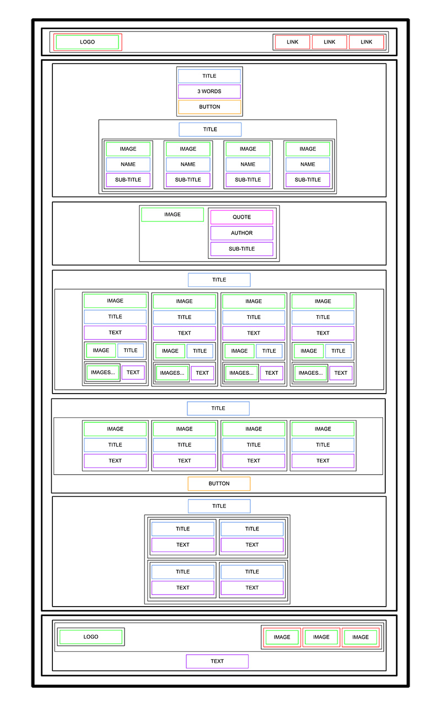

# HTML ADVANCED

# Learning Objectives

At the end of this project, you are expected to be able to [explain to anyone](https://fs.blog/feynman-learning-technique/), without the help of Google:

- What is HTML
- How to create an HTML page from a wireframe
- What is a markup language
- What is the DOM
- What is an element / tag
- What is an attribute
- What the purpose of each HTML tag

The primary objective of this project is to develop the specified website according to the provided design.

